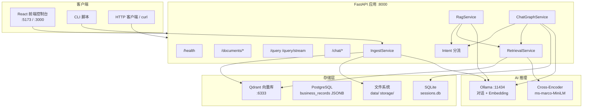
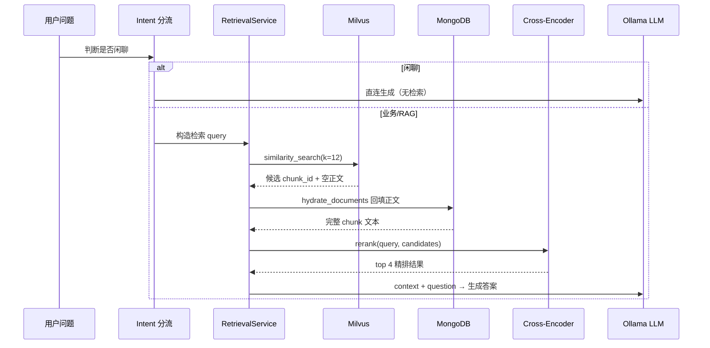
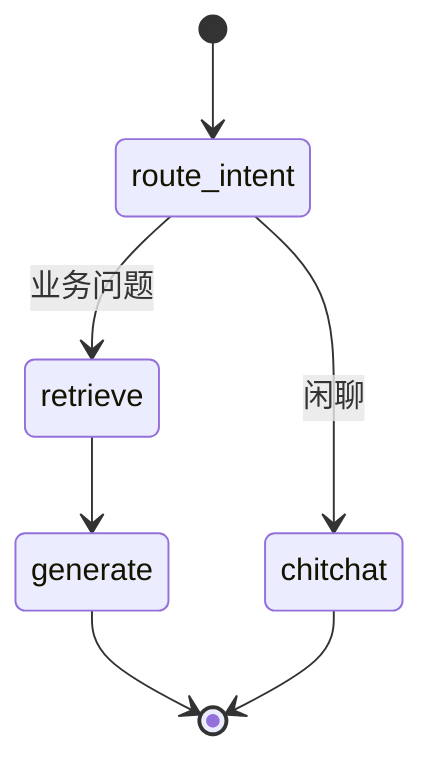

# LandChain 系统介绍文档

> 版本：0.5.0  
> 更新日期：2026-06-12  
> 适用对象：产品、开发、运维、业务使用者

---

## 目录

1. [系统概述](#1-系统概述)
2. [技术架构](#2-技术架构)
3. [功能模块总览](#3-功能模块总览)
4. [知识库与文档管理](#4-知识库与文档管理)
5. [RAG 检索与问答](#5-rag-检索与问答)
6. [多轮对话与会话管理](#6-多轮对话与会话管理)
7. [闲聊与业务问答分流](#7-闲聊与业务问答分流)
8. [订单数据与经营报告](#8-订单数据与经营报告)
9. [HTTP API 接口](#9-http-api-接口)
10. [前端控制台](#10-前端控制台)
11. [CLI 命令行工具](#11-cli-命令行工具)
12. [部署与运维](#12-部署与运维)
13. [配置项说明](#13-配置项说明)
14. [典型使用场景](#14-典型使用场景)
15. [限制与注意事项](#15-限制与注意事项)

---

## 1. 系统概述

### 1.1 定位

**LandChain** 是一套面向企业知识库与经营数据问答的 **RAG（检索增强生成）** 系统。它将结构化/非结构化文档、PostgreSQL 业务订单聚合报告统一纳入 Qdrant 向量知识库，通过本地 **Ollama** 大模型完成语义检索与自然语言回答。

系统当前主要服务于两类场景：

| 场景 | 数据来源 | 典型问题 |
|------|----------|----------|
| **企业知识库问答** | `data/` 目录 Markdown/PDF/TXT、HTTP 上传文档 | 「怀仁产业集团的三域增长系统是什么？」 |
| **经营数据问答** | PostgreSQL `order` 集合 → 统计 Markdown 报告 | 「2025 年总销售额多少？」「哪个渠道销售额最高？」 |

### 1.2 核心价值

- **本地推理**：Embedding 与对话均通过 Ollama 完成，数据不出本机（对话模型可配置为云端推理）。
- **持久化向量库**：Qdrant 统一存储向量与 chunk 原文 payload，服务重启无需重新 embedding。
- **业务数据分离**：PostgreSQL JSONB 存储订单等业务 JSON，Agent 与统计脚本直接查询。
- **检索精度增强**：向量召回 + Cross-Encoder 二次精排。
- **多轮对话**：LangGraph + SQLite 持久化会话记忆。
- **开箱即用控制台**：React 前端提供聊天、文档管理、服务状态监控。

### 1.3 系统边界

| 包含 | 不包含 |
|------|--------|
| 文档导入、切分、向量化、检索、问答 | 用户鉴权 / RBAC（当前无鉴权） |
| 多轮会话记忆与历史查询 | 在线文档编辑 |
| PostgreSQL 订单聚合报告生成 | 实时订单流式同步（需 CLI 触发） |
| 健康检查与状态面板 | 多租户隔离 |

---

## 2. 技术架构

### 2.1 整体架构图



### 2.2 技术栈

| 层级 | 技术 |
|------|------|
| **后端框架** | FastAPI 0.115+、Uvicorn |
| **AI 编排** | LangChain 0.3+、LangGraph 1.2+ |
| **大模型** | Ollama（`gpt-oss:120b-cloud` 对话、`nomic-embed-text` 嵌入） |
| **向量数据库** | Qdrant 1.12+（向量 + payload 原文） |
| **业务数据库** | PostgreSQL 16（JSONB `business_records`） |
| **会话持久化** | LangGraph SqliteSaver |
| **重排序** | sentence-transformers Cross-Encoder |
| **前端** | React 19、Vite、TypeScript、Tailwind CSS 4、React Router |
| **容器化** | Docker Compose（API + 前端 + Qdrant + PostgreSQL） |

### 2.3 项目目录结构

```
landchain/
├── app/                          # 后端应用
│   ├── main.py                   # FastAPI 入口、生命周期、依赖注入
│   ├── config.py                 # 环境变量与 Settings
│   ├── models/schemas.py         # 请求/响应 Pydantic 模型
│   ├── routers/                  # HTTP 路由
│   │   ├── health.py             # 健康检查
│   │   ├── documents.py          # 文档上传与批量导入
│   │   ├── query.py              # 单轮问答（JSON / SSE）
│   │   └── chat.py               # 多轮对话（JSON / SSE / 会话管理）
│   └── services/                 # 业务服务
│       ├── ollama_client.py      # Ollama 模型创建与健康探测
│       ├── vectorstore.py        # Qdrant 向量操作
│       ├── postgres_business_store.py # 业务 JSON 集合读写
│       ├── ingest.py             # 文档加载、切分、入库
│       ├── retrieval.py          # 向量检索 + 重排
│       ├── rerank.py             # Cross-Encoder 精排
│       ├── rag.py                # 单轮 RAG 问答
│       ├── chat_graph.py         # LangGraph 多轮对话图
│       ├── intent.py             # 闲聊/业务意图识别
│       └── order_report.py       # 订单统计 → Markdown 报告
├── frontend/                     # React 控制台
│   ├── src/pages/                # 聊天 / 文档 / 设置 三页
│   ├── src/components/           # UI 组件
│   ├── src/api/                  # API 客户端与 SSE 解析
│   └── src/hooks/                # useChat / useHealth
├── data/                         # 预置知识库与订单报告
│   ├── sample.md                 # 系统说明示例
│   ├── 怀仁产业集团.md            # 企业知识库
│   └── orders/                   # 订单经营报告 Markdown
├── storage/                      # 运行时数据（自动生成）
│   ├── ingest_index.json         # 增量导入 mtime 索引
│   ├── sessions.db               # 会话 checkpoint
│   ├── uploads/                  # HTTP 上传文件
│   └── hf_cache/                 # Cross-Encoder 模型缓存
├── scripts/                      # CLI 工具
│   ├── ingest_data.py            # 手动批量导入
│   ├── seed_order_test_data.py   # 写入测试订单
│   └── sync_orders_to_rag.py     # 订单报告生成 + RAG 入库
├── docker-compose.yml            # 一键部署
├── Dockerfile                    # API 镜像
└── docs/                         # 文档
```

---

## 3. 功能模块总览

下表列出系统全部功能点，后文逐节展开。

| 编号 | 模块 | 功能点 |
|------|------|--------|
| F01 | 启动自检 | 服务启动时自动增量扫描 `data/` 目录 |
| F02 | 文档格式 | 支持 PDF、TXT、Markdown |
| F03 | 文档上传 | HTTP multipart 上传，即时入库 |
| F04 | 批量导入 | 扫描 `data/` 递归导入，mtime 增量跳过 |
| F05 | 文本切分 | Markdown 标题两阶段 + 递归兜底，800/120 |
| F06 | 向量化 | Ollama `nomic-embed-text`，768 维 |
| F07 | 向量存储 | Milvus COSINE 相似度检索 |
| F08 | 正文存储 | MongoDB `document_chunks` + `documents` |
| F09 | 同名覆盖 | 同 source 文件重新导入时先删旧 chunk |
| F10 | 单轮问答 | POST `/query` JSON 一次性返回 |
| F11 | 流式问答 | POST `/query/stream` SSE 逐 token |
| F12 | 多轮对话 | POST `/chat` 带 session_id |
| F13 | 流式对话 | POST `/chat/stream` SSE + session 事件 |
| F14 | 会话历史 | GET `/chat/sessions/{id}/history` |
| F15 | 清除会话 | DELETE `/chat/sessions/{id}` |
| F16 | 会话持久化 | SQLite checkpoint，跨请求记忆 |
| F17 | 向量召回 | 默认召回 12 个候选 chunk |
| F18 | Cross-Encoder 重排 | 精排后取 top 4 送入 LLM |
| F19 | Mongo 回填 | 检索后从 Mongo 拉取 chunk 正文 |
| F20 | 闲聊分流 | 问候/闲聊直连 LLM，跳过检索 |
| F21 | 业务关键词保护 | 含「订单」「统计」等词强制走 RAG |
| F22 | 健康检查 | Ollama / Milvus / Mongo 连通性与统计 |
| F23 | 订单测试数据 | CLI 批量写入 Mongo `order` 集合 |
| F24 | 订单报告生成 | 按时间区间聚合 KPI、维度、台账 |
| F25 | 订单报告入库 | 报告 Markdown 切分后进入 RAG |
| F26 | 前端聊天 | SSE 流式、停止生成、引用来源 |
| F27 | 前端文档管理 | 拖拽上传、批量导入、上传记录 |
| F28 | 前端设置 | API 地址、服务状态、模型信息 |
| F29 | Docker 部署 | API + 前端 + MongoDB + Milvus 一键启动 |
| F30 | CLI 工具 | ingest / seed / sync 三条流水线 |

---

## 4. 知识库与文档管理

### 4.1 支持的文档格式

| 格式 | 扩展名 | 加载器 | 说明 |
|------|--------|--------|------|
| PDF | `.pdf` | `PyPDFLoader` | 按页提取文本 |
| 纯文本 | `.txt` | `TextLoader` (UTF-8) | 直接读取 |
| Markdown | `.md` | `TextLoader` (UTF-8) | 保留原始 Markdown 文本 |

不支持的格式会在上传或导入时返回 `400 Unsupported file type`。

### 4.2 文档来源

系统接受三类文档来源：

1. **预置目录 `data/`**  
   项目内置示例与企业知识库，如 `sample.md`、`怀仁产业集团.md`、`data/orders/*.md`。

2. **HTTP 上传**  
   通过 `POST /documents/upload` 或前端拖拽上传，文件保存至 `storage/uploads/`，并 **强制重新入库**（`force=True`）。

3. **CLI / 脚本生成**  
   `sync_orders_to_rag.py` 生成的订单报告写入 `data/orders/`，再经 ingest 入库。

### 4.3 文本切分策略

| 参数 | 默认值 | 环境变量 | 说明 |
|------|--------|----------|------|
| chunk 大小 | 800 字符 | `CHUNK_SIZE` | 每个 chunk 最大长度 |
| 重叠长度 | 120 字符 | `CHUNK_OVERLAP` | 相邻 chunk 重叠，减少语义断裂 |
| Markdown 切分 | 两阶段 | — | `MarkdownHeaderTextSplitter`（`#`/`##`/`###`）→ `RecursiveCharacterTextSplitter` 兜底 |
| PDF/TXT 切分 | 递归 | — | 中文友好分隔符（段落、表格行、中文标点） |

**Markdown 两阶段流程**（约 90% 文档为 `.md`）：

1. 按标题层级切分为语义完整的节
2. 单节超过 `CHUNK_SIZE` 时，按段落 / 表格行 / 中文标点递归切分

每个 chunk 元数据包含：

- `source`：文件绝对路径（作为唯一来源标识）
- `filename`：文件名
- `chunk_index`：在文件内的序号
- `chunk_id`：UUID
- `heading_path`：章节路径（如 `一、集团合并财务报表 > 1.1 合并利润表`）
- `Header 1` / `Header 2` / `Header 3`：各级标题（Markdown 专用）

检索 API（`/query`、`/chat`）除 `sources`（去重文件路径）外，另返回 `citations` 列表，含 `filename`、`heading_path`、`chunk_index`，供前端引用面板展示章节。

**切分策略变更后**需执行 `python scripts/ingest_data.py --force` 全量重入库。

### 4.4 增量导入机制

系统通过 `storage/ingest_index.json` 记录每个 `source` 文件的 **mtime（修改时间）**：

- **启动时**：`main.py` lifespan 自动调用 `ingest_directory()`，仅处理新增或变更文件。
- **手动触发**：`POST /documents/ingest` 或 `python scripts/ingest_data.py`。
- **强制全量**：`--force` 忽略 mtime，全部重新 embedding。
- **跳过逻辑**：mtime 未变则 `chunks_added=0`，记入 `skipped` 列表。

### 4.5 双存储写入流程

启用 MongoDB 时，导入流程如下：

```
文件 → 加载 → 切分
  ├─ MongoDB documents：文件级元数据（filename, mtime, chunk_count）
  ├─ MongoDB document_chunks：每个 chunk 的 content + metadata
  └─ Milvus：embedding 向量 + chunk_id 引用（text 字段为空）
```

**重新导入同名文件时**：

1. `vectorstore.delete_by_source(source)` 删除 Milvus 中该 source 的全部向量
2. `mongo_store.delete_by_source(source)` 删除 Mongo 中对应 chunks 与 document 记录
3. 写入新 chunks 与新向量

### 4.6 上传限制

| 限制项 | 值 | 配置 |
|--------|-----|------|
| 单文件大小 | 20 MB | `MAX_UPLOAD_SIZE_MB` |
| 允许扩展名 | `.pdf` `.txt` `.md` | `allowed_extensions`（代码内固定） |
| Ollama 依赖 | 上传前检查 | 不可达返回 503 |

---

## 5. RAG 检索与问答

### 5.1 检索流水线



### 5.2 检索参数

| 参数 | 默认值 | 说明 |
|------|--------|------|
| `RETRIEVE_K` | 12 | Milvus 向量召回候选数 |
| `TOP_K` | 4 | 重排后送入 LLM 的 chunk 数 |
| 请求级 `top_k` | 可选 1–20 | API 请求体可覆盖默认值 |

重排启用时，候选数取 `max(retrieve_k, top_k, top_k * 2)`，确保有足够样本供精排。

### 5.3 Cross-Encoder 重排序

| 项 | 说明 |
|----|------|
| 模型 | `cross-encoder/ms-marco-MiniLM-L-6-v2`（可配置） |
| 设备 | CPU |
| 开关 | `RERANK_ENABLED=true/false` |
| 缓存 | Docker 部署时挂载 `./storage/hf_cache` |
| 降级 | 关闭重排或候选数 ≤ top_k 时直接截断 |

重排对 `(query, chunk_content)` 打分，按分数降序取 top_k。

### 5.4 单轮问答（RagService）

**系统提示词要点**：

- 仅根据检索上下文回答
- 无相关信息时明确回复「知识库中未找到相关内容」
- 禁止编造上下文不存在的信息

**响应字段**：

| 字段 | 类型 | 说明 |
|------|------|------|
| `answer` | string | 模型生成的回答 |
| `sources` | string[] | 去重后的文件路径列表 |
| `chunks_used` | int | 实际使用的 chunk 数量 |
| `mode` | string | `rag` 或 `chitchat` |

### 5.5 SSE 流式输出

**单轮** `POST /query/stream`：

| 事件 | 数据 | 说明 |
|------|------|------|
| `token` | `{ "text": "..." }` | 逐 token 文本片段 |
| `done` | `{ "sources", "chunks_used", "mode" }` | 完成信号 |
| `error` | `{ "message" }` | 异常信息 |

流式模式下，sources 在检索完成后即确定，token 事件仅传输生成内容。

---

## 6. 多轮对话与会话管理

### 6.1 LangGraph 对话图

多轮对话由 `ChatGraphService` 基于 LangGraph 状态图实现：



**状态字段（ChatState）**：

| 字段 | 说明 |
|------|------|
| `messages` | 对话历史（HumanMessage / AIMessage） |
| `context` | 检索到的上下文文本 |
| `sources` | 引用来源 |
| `chunks_used` | 使用 chunk 数 |
| `mode` | `rag` / `chitchat` |

### 6.2 多轮检索 query 构造

为提升追问场景的检索效果，系统对检索 query 有特殊处理：

- 默认使用 **最新一条用户消息** 作为检索 query
- 若最新消息 ≤ 30 字 **且** 存在上一条用户消息，则拼接：`上一条 + 换行 + 最新一条`  
  示例：先问「怀仁产业集团」，再问「总部在哪」→ 检索 query 为两句合并

### 6.3 会话持久化

| 项 | 说明 |
|----|------|
| 存储 | SQLite（`storage/sessions.db`） |
| 机制 | LangGraph `SqliteSaver` checkpoint |
| 线程 ID | `session_id`（UUID，首次请求自动生成） |
| 跨请求 | 同一 `session_id` 可恢复完整对话历史 |

### 6.4 会话 API

| 接口 | 方法 | 功能 |
|------|------|------|
| `/chat` | POST | 多轮问答，JSON 返回 |
| `/chat/stream` | POST | 多轮问答，SSE 流式 |
| `/chat/sessions/{id}/history` | GET | 获取会话历史（user/assistant 消息列表） |
| `/chat/sessions/{id}` | DELETE | 删除会话 checkpoint |

**流式对话额外事件**：

- 首个事件 `event: session`，返回 `{ "session_id": "..." }`

### 6.5 流式对话的状态更新

流式模式下，LangGraph 不在 invoke 中自动追加消息。`stream()` 方法在 token 流结束后，通过 `update_state` 手动写入本轮 HumanMessage + AIMessage，保证历史一致性。

---

## 7. 闲聊与业务问答分流

### 7.1 设计目的

日常问候、感谢、讲笑话等 **不需要检索知识库** 的交互，直连 LLM 可：

- 降低延迟（跳过 embedding + Milvus + 重排）
- 避免无意义检索污染上下文
- 提供更自然的对话体验

### 7.2 识别规则（`intent.py`）

**前置条件**：`CHITCHAT_DIRECT_ENABLED=true`

**强制走 RAG（非闲聊）**：消息中包含以下任一关键词：

```
订单、金额、价格、文档、查询、搜索、多少、统计、合计、
客户、产品、酒、mongo、landchain、O0、怀仁、朔州、知识库、来源、chunk
```

**闲聊模式匹配**（正则，大小写不敏感）：

| 类型 | 示例 |
|------|------|
| 问候 | 你好、您好、hi、hello |
| 时段问候 | 早上好、晚安 |
| 感谢 | 谢谢、thanks |
| 情绪 | 哈哈哈、太搞笑了 |
| 在线确认 | 在吗、有人吗 |
| 自我介绍 | 你是谁、你能做什么 |
| 娱乐 | 讲个笑话 |
| 随意聊 | 无聊、聊聊天 |
| 告别 | 再见、bye |

**长度辅助**：消息 ≤ `CHITCHAT_MAX_LENGTH`（默认 24）且匹配上述模式时判定为闲聊。

### 7.3 响应差异

| 模式 | `mode` | `sources` | `chunks_used` | 系统提示词 |
|------|--------|-----------|---------------|------------|
| 闲聊 | `chitchat` | `[]` | `0` | 友好助手，不假装检索 |
| RAG | `rag` | 文件路径列表 | > 0 | 仅根据上下文回答 |

---

## 8. 订单数据与经营报告

### 8.1 数据模型

业务订单存储在 MongoDB 业务集合（默认 `order`），由 `MongoBusinessStore` 管理。

**索引**：

- `{ID}`：唯一索引（字段名可配置 `MONGODB_BUSINESS_ID_FIELD`）
- `{created_at}`：时间范围查询索引（`MONGODB_BUSINESS_TIME_FIELD`）

**测试订单字段**（`seed_order_test_data.py` 生成）：

| 字段 | 类型 | 说明 |
|------|------|------|
| `ID` | string | 订单号，如 `O0001` |
| `created_at` | ISO-8601 | 创建时间 |
| `customer` | string | 客户姓名 |
| `product_name` | string | 产品名称 |
| `wine_type` | string | 酒类（白酒/红酒/黄酒/啤酒） |
| `brand` | string | 品牌 |
| `spec` | string | 规格 |
| `unit_price` | float | 单价 |
| `quantity` | int | 数量 |
| `amount` | float | 金额 |
| `channel` | string | 渠道 |
| `status` | string | 订单状态 |
| `region` | string | 区域 |
| `remark` | string | 备注 |

### 8.2 订单报告内容

`OrderReportGenerator` 按 `created_at` 时间区间从 Mongo 拉取订单，生成 Markdown 报告，默认输出至：

```
data/orders/order-report_{开始日期}_{结束日期}.md
```

**报告章节**：

| 章节 | 内容 |
|------|------|
| 汇总 KPI | 订单总数、总销售额、总销量、客单价 |
| 月度明细 | 按月统计订单数、销售额、销量 |
| 分品牌统计 | 各品牌订单数与销售额 |
| 分渠道统计 | 门店零售、电商小程序、企业团购等 |
| 分区域统计 | 怀仁、朔州、大同、太原等 |
| 分酒类统计 | 白酒、红酒、黄酒、啤酒 |
| 订单明细台账 | 全量订单表格（订单号、日期、客户、SKU、金额等） |

### 8.3 同步流水线


**CLI 模式**：

| 参数 | 功能 |
|------|------|
| `--from` / `--to` | 时间区间（ISO-8601） |
| `--collection` | 指定业务集合名 |
| `--output-dir` | 报告输出目录 |
| `--generate-only` | 只生成 Markdown，不入库 |
| `--ingest-only --file` | 只入库已有报告 |
| `--dry-run` | 仅统计匹配订单数 |

### 8.4 RAG 中的订单问答

报告入库后，`source` 为报告文件的绝对路径。用户可提问：

- 「2025 年 1 月销售额是多少？」
- 「哪个品牌销售额最高？」
- 「订单 O0042 买了什么？」
- 「经销商批发渠道有多少订单？」

系统通过向量检索定位报告中的相关表格/段落，再由 LLM 组织回答。

---

## 9. HTTP API 接口

### 9.1 接口总表

| 方法 | 路径 | 标签 | 功能 |
|------|------|------|------|
| GET | `/health` | health | 健康检查 |
| POST | `/documents/upload` | documents | 上传文档 |
| POST | `/documents/ingest` | documents | 扫描 data/ 增量导入 |
| POST | `/query` | query | 单轮问答 |
| POST | `/query/stream` | query | 单轮流式问答 |
| POST | `/chat` | chat | 多轮问答 |
| POST | `/chat/stream` | chat | 多轮流式问答 |
| GET | `/chat/sessions/{session_id}/history` | chat | 会话历史 |
| DELETE | `/chat/sessions/{session_id}` | chat | 清除会话 |

交互式文档：http://localhost:8000/docs

### 9.2 GET /health

**响应示例**：

```json
{
  "status": "ok",
  "ollama_reachable": true,
  "qdrant_reachable": true,
  "chunk_count": 128,
  "chat_model": "gpt-oss:120b-cloud",
  "embed_model": "nomic-embed-text",
  "rerank_enabled": true,
  "rerank_model": "cross-encoder/ms-marco-MiniLM-L-6-v2",
  "postgres_reachable": true,
}
```

**状态判定**：

- `status=ok`：Ollama 可达 **且** Qdrant 可达 **且** PostgreSQL 可达
- `status=degraded`：上述任一不满足

### 9.3 POST /documents/upload

- **Content-Type**：`multipart/form-data`
- **字段**：`file`（必填）
- **成功响应**：`filename`、`chunks_added`、`sources`
- **错误**：400（格式/大小）、503（Ollama 不可用）、500（入库失败）

### 9.4 POST /documents/ingest

- **请求体**：无
- **响应**：`files_processed`、`chunks_added`、`skipped`（跳过文件路径列表）

### 9.5 POST /query

**请求体**：

```json
{
  "question": "LandChain 支持哪些文档格式？",
  "top_k": 4
}
```

**响应体**：见 5.4 节。

### 9.6 POST /query/stream

请求体同 `/query`。SSE 事件见 5.5 节。

### 9.7 POST /chat

**请求体**：

```json
{
  "session_id": "可选，不传则自动生成",
  "message": "用户消息",
  "top_k": 4
}
```

**响应体**：`session_id`、`answer`、`sources`、`chunks_used`、`mode`

### 9.8 POST /chat/stream

请求体同 `/chat`。首个 SSE 事件为 `session`，其余见 6.4 节。

### 9.9 GET /chat/sessions/{session_id}/history

**响应**：

```json
{
  "session_id": "uuid",
  "messages": [
    { "role": "user", "content": "..." },
    { "role": "assistant", "content": "..." }
  ]
}
```

### 9.10 DELETE /chat/sessions/{session_id}

**响应**：`{ "session_id": "...", "cleared": true }`

### 9.11 通用错误码

| HTTP 状态 | 场景 |
|-----------|------|
| 400 | 参数校验失败、不支持的文件类型、文件过大 |
| 503 | Ollama 服务不可用 |
| 500 | 检索/生成/入库内部异常 |

---

## 10. 前端控制台

### 10.1 技术栈与路由

| 路由 | 页面 | 功能 |
|------|------|------|
| `/` | ChatPage | 知识库聊天 |
| `/documents` | DocumentsPage | 文档管理 |
| `/settings` | SettingsPage | 系统设置 |

技术：React 19 + Vite + TypeScript + Tailwind CSS 4 + React Router + lucide-react 图标。

### 10.2 聊天页（ChatPage）

| 功能点 | 实现说明 |
|--------|----------|
| **多轮对话** | 调用 `POST /chat/stream`，SSE 逐 token 渲染 |
| **会话持久化** | `session_id` 存 localStorage（`landchain_session_id`） |
| **历史恢复** | 页面加载时 `GET /chat/sessions/{id}/history` |
| **新建会话** | 清除 localStorage 与 UI 消息，不删服务端（新 ID 自动生成） |
| **清空记忆** | `DELETE /chat/sessions/{id}` + 重置本地状态 |
| **停止生成** | AbortController 中断 SSE 请求 |
| **引用来源** | 桌面端右侧 SourcePanel；移动端底部折叠展示 |
| **错误提示** | Ollama 503 等友好错误文案 |
| **流式光标** | `streaming` 状态 MessageBubble 展示 |

### 10.3 文档页（DocumentsPage）

| 功能点 | 实现说明 |
|--------|----------|
| **拖拽上传** | UploadDropzone，支持 PDF/TXT/MD |
| **即时入库** | 上传成功显示 chunks_added |
| **批量导入** | IngestButton 触发 `POST /documents/ingest` |
| **导入结果** | 展示处理文件数、新增 chunks、跳过数 |
| **上传记录** | 前端会话内 UploadHistory 列表（文件名、chunks、时间） |
| **错误处理** | ErrorBanner 可关闭 |

### 10.4 设置页（SettingsPage）

| 功能点 | 实现说明 |
|--------|----------|
| **API 地址配置** | 可覆盖 `/api` 或 `http://localhost:8000` |
| **保存/恢复默认** | localStorage 持久化 API base |
| **服务状态面板** | 展示 health 全部字段 |
| **手动检测** | 点击刷新 health |
| **状态徽章** | StatusBadge 绿/红标识可达性 |

### 10.5 API 代理

| 环境 | API 基址 | 说明 |
|------|----------|------|
| 开发 | Vite proxy `/api` → `:8000` | `vite.config.ts` |
| Docker 生产 | Nginx `/api` 反代 | `frontend/nginx.conf`，端口 3000 |
| 直连 | `VITE_API_BASE_URL` 环境变量 | 构建时注入 |

### 10.6 启动方式

```powershell
# 开发
uvicorn app.main:app --reload --host 0.0.0.0 --port 8000   # 后端
cd frontend && npm install && npm run dev                    # 前端 :5173

# 生产构建
cd frontend && npm run build   # 产物 frontend/dist/
```

---

## 11. CLI 命令行工具

### 11.1 ingest_data.py — 批量导入文档

```bash
python scripts/ingest_data.py              # 扫描 DATA_DIR
python scripts/ingest_data.py --dir ./data   # 指定目录
python scripts/ingest_data.py --force      # 强制全量重导
```

**输出**：处理文件数、新增 chunks、Milvus 总量、Mongo chunks 量、跳过列表。

### 11.2 seed_order_test_data.py — 写入测试订单

```bash
python scripts/seed_order_test_data.py --count 1000
python scripts/seed_order_test_data.py --count 500 --from 2025-01-01T00:00:00Z --to 2025-12-31T23:59:59Z
python scripts/seed_order_test_data.py --collection order --id-prefix O
```

**参数**：

| 参数 | 默认 | 说明 |
|------|------|------|
| `--count` | 1000 | 生成订单数 |
| `--collection` | `order` | Mongo 集合名 |
| `--id-prefix` | `O` | 订单号前缀 → O0001 |
| `--from` / `--to` | 2025-01-01 ~ 2026-06-30 | 时间分布区间 |
| `--batch-size` | 100 | Mongo bulk_write 批次 |

### 11.3 sync_orders_to_rag.py — 订单报告 + RAG 入库

```bash
# 完整流程：查询 → 生成报告 → ingest
python scripts/sync_orders_to_rag.py \
  --from 2025-01-01T00:00:00Z \
  --to 2026-06-30T23:59:59Z

# 只生成 Markdown
python scripts/sync_orders_to_rag.py --from ... --to ... --generate-only

# 只 ingest 已有文件
python scripts/sync_orders_to_rag.py --ingest-only --file data/orders/order-report_2025-01-01_2026-06-30.md

# 预览匹配数量
python scripts/sync_orders_to_rag.py --from ... --to ... --dry-run
```

Docker 内执行：

```powershell
docker compose exec api python scripts/sync_orders_to_rag.py --from 2025-01-01T00:00:00Z --to 2026-06-30T23:59:59Z
```

---

## 12. 部署与运维

### 12.1 部署模式对比

| 模式 | 适用 | 组件 |
|------|------|------|
| **本地开发** | 日常开发调试 | 本机 uvicorn + 本机 Ollama + Docker Mongo/Milvus（可选） |
| **Docker Compose** | 演示/内网部署 | API + 前端 + MongoDB + Milvus（Ollama 仍宿主机） |

### 12.2 Docker Compose 服务

| 服务 | 容器名 | 端口 | 说明 |
|------|--------|------|------|
| api | landchain-api | 8000 | FastAPI，挂载 data/ 与 storage/ |
| frontend | landchain-web | 3000 | Nginx 静态站 + /api 反代 |
| qdrant | landchain-qdrant | 6333 | Qdrant 向量库 |
| postgres | landchain-postgres | 5432 | PostgreSQL 16 |

### 12.3 关键挂载与卷

| 路径/卷 | 用途 |
|---------|------|
| `./data` → `/app/data` | 知识库与订单报告 |
| `./storage` → `/app/storage` | 会话、上传、HF 缓存、ingest 索引 |
| `qdrant_data` | Qdrant 持久化 |
| `postgres_data` | PostgreSQL 持久化 |

### 12.4 Ollama 网络

- **本机直跑 API**：`OLLAMA_BASE_URL=http://localhost:11434`
- **API 在 Docker 内**：compose 覆盖为 `http://host.docker.internal:11434`
- Ollama **不容器化**，需宿主机预先 `ollama pull` 模型

### 12.5 健康检查与日志

```powershell
# 服务健康
Invoke-RestMethod http://localhost:8000/health
Invoke-RestMethod http://localhost:9091/healthz   # Milvus

# 日志
docker compose logs -f api
docker compose logs -f frontend
```

### 12.6 常用运维操作

| 操作 | 命令 |
|------|------|
| 启动全部 | `docker compose up -d --build` |
| 仅启动 Mongo | `docker compose up -d mongodb` |
| 仅启动 Milvus | `docker compose up -d etcd minio milvus` |
| 停止 | `docker compose down` |
| 清空数据卷 | `docker compose down -v`（慎用） |
| 强制全量重导 | `docker compose exec api python scripts/ingest_data.py --force` |
| Milvus 管理界面 | http://localhost:9091/webui |

### 12.7 验证清单

1. `GET /health` → `ollama_reachable: true`，`chunk_count > 0`
2. `data/sample.md` 启动后自动入库
3. `POST /query` 返回答案与 sources
4. `POST /query/stream` SSE 逐 token 正常
5. `POST /documents/upload` 上传后可立即问答
6. `POST /chat` 多轮 session_id 可复用
7. `GET /chat/sessions/{id}/history` 历史正确
8. Ollama 停服 → 503
9. 订单 seed + sync → RAG 可答经营数据
10. 前端 :5173 / :3000 聊天流式与来源展示正常

---

## 13. 配置项说明

完整配置见 `.env.example`，下表为全部环境变量：

| 变量 | 默认值 | 说明 |
|------|--------|------|
| `OLLAMA_BASE_URL` | `http://localhost:11434` | Ollama 服务地址 |
| `OLLAMA_CHAT_MODEL` | `gpt-oss:120b-cloud` | 对话模型 |
| `OLLAMA_EMBED_MODEL` | `nomic-embed-text` | 嵌入模型（768 维） |
| `MILVUS_URI` | `http://localhost:19530` | Milvus 连接地址 |
| `MILVUS_COLLECTION` | `landchain_rag` | Collection 名称 |
| `MILVUS_METRIC` | `COSINE` | 向量距离度量 |
| `DATA_DIR` | `./data` | 预置文档目录 |
| `CHUNK_SIZE` | `800` | 文本切分大小 |
| `CHUNK_OVERLAP` | `120` | 切分重叠 |
| `TOP_K` | `4` | 重排后送入 LLM 的 chunk 数 |
| `RETRIEVE_K` | `12` | 向量召回候选数 |
| `RERANK_ENABLED` | `true` | Cross-Encoder 开关 |
| `RERANK_MODEL` | `cross-encoder/ms-marco-MiniLM-L-6-v2` | 重排模型 |
| `SESSION_DB_PATH` | `./storage/sessions.db` | 会话 SQLite 路径 |
| `MAX_UPLOAD_SIZE_MB` | `20` | 上传大小上限 |
| `CORS_ORIGINS` | 见 `.env.example` | 允许跨域的前端 origin |
| `MONGODB_ENABLED` | `true` | MongoDB 开关 |
| `MONGODB_URI` | 见 `.env.example` | MongoDB 连接串 |
| `MONGO_DATABASE` | `landchain` | 数据库名 |
| `MONGODB_DOCUMENTS_COLLECTION` | `documents` | 文件元数据集合 |
| `MONGODB_CHUNKS_COLLECTION` | `document_chunks` | chunk 正文集合 |
| `MONGODB_BUSINESS_COLLECTION` | `order` | 业务 JSON 集合 |
| `MONGODB_BUSINESS_ID_FIELD` | `ID` | 业务主键字段 |
| `MONGODB_BUSINESS_TIME_FIELD` | `created_at` | 时间过滤字段 |
| `CHITCHAT_DIRECT_ENABLED` | `true` | 闲聊直连开关 |
| `CHITCHAT_MAX_LENGTH` | `24` | 闲聊长度辅助阈值 |
| `MONGO_ROOT_USERNAME` | `landchain` | Docker Mongo 管理员 |
| `MONGO_ROOT_PASSWORD` | `landchain` | Docker Mongo 密码 |

**模型替换建议**：

- 本地离线对话：`OLLAMA_CHAT_MODEL=qwen3:8b`
- 中文向量增强：`OLLAMA_EMBED_MODEL=qwen3-embedding:0.6b`（需清空向量库后重新导入）

---

## 14. 典型使用场景

### 14.1 企业知识库问答

**准备**：将企业文档放入 `data/`，或通过前端上传。

**示例对话**：

- 「怀仁产业集团的三域增长系统是什么？」
- 「石荣霄品牌的历史渊源？」
- 「酱香型白酒的品鉴步骤有哪些？」

**预期**：`mode=rag`，`sources` 含 `怀仁产业集团.md` 路径。

### 14.2 经营数据问答

**准备**：

```bash
python scripts/seed_order_test_data.py --count 1000
python scripts/sync_orders_to_rag.py --from 2025-01-01T00:00:00Z --to 2026-06-30T23:59:59Z
```

**示例对话**：

- 「2025 年总销售额是多少？」
- 「哪个品牌销售额最高？」
- 「太原区域有多少订单？」
- 「订单 O0123 的金额是多少？」

**预期**：`sources` 含 `data/orders/order-report_*.md`。

### 14.3 多轮追问

```
用户：介绍一下怀仁产业集团
助手：（基于知识库回答）

用户：总部在哪里？
助手：（检索 query 合并上一轮上下文，回答贵阳总部）
```

### 14.4 闲聊

```
用户：你好
助手：mode=chitchat，友好问候，sources 为空

用户：讲个笑话
助手：mode=chitchat，直接生成笑话
```

### 14.5 API 集成

第三方系统可通过 HTTP API 集成：

- 客服机器人：使用 `/chat/stream` 多轮 + session_id
- 一次性查询：使用 `/query`
- 文档同步：定时 `POST /documents/ingest` 或调用 CLI

---

## 15. 限制与注意事项

### 15.1 安全

- **当前无鉴权**：所有 API 公开访问，仅适合本地/内网开发。
- 生产环境需增加 API Key、OAuth 或反向代理鉴权。

### 15.2 性能

- Ollama 本地推理通常 **串行**，高并发请求会排队。
- 首次加载 Cross-Encoder 模型较慢，建议持久化 `storage/hf_cache`。
- 大 PDF 或多文件全量 `--force` 导入耗时与 embedding 次数成正比。

### 15.3 数据一致性

- 上传/重导 **同名文件** 会先删旧 chunk 再写入，避免重复。
- Milvus 与 Mongo 数据 **不自动双向同步**；禁用 Mongo 后 fallback 为 Milvus 存正文（兼容模式）。
- 从 Chroma 迁移到 Milvus 后向量不互通，需 `--force` 重导。

### 15.4 订单数据

- 订单报告为 **区间快照**，非实时；新业务数据需重新执行 `sync_orders_to_rag.py`。
- 旧版「逐条 JSON 入 RAG」残留 chunk（`mongo://order/{ID}`）需手动清理或全量重导。

### 15.5 模型依赖

- `gpt-oss:120b-cloud` 为云端推理模型，需 Ollama 联网。
- 嵌入模型维度固定 768，更换模型需清空 Milvus collection 后重导。

### 15.6 前端限制

- 上传记录仅存于 **当前浏览器会话**（非服务端持久化）。
- 会话 ID 存 localStorage，清除浏览器数据会丢失本地 session 引用（服务端 SQLite 仍保留，需重新输入 ID 或新建）。

---

## 附录 A：预置知识库说明

| 文件 | 用途 |
|------|------|
| `data/sample.md` | LandChain 系统功能说明，用于验证 RAG 链路 |
| `data/怀仁产业集团.md` | 怀仁产业集团企业知识库（品牌、工艺、销售话术等） |
| `data/怀仁产业集团-经营数据.md` | 经营相关补充数据（如有） |
| `data/orders/order-report_*.md` | Mongo 订单聚合报告，供经营问答 |

## 附录 B：依赖版本（requirements.txt）

```
fastapi>=0.115.0
uvicorn[standard]>=0.32.0
langchain>=0.3.0
langchain-ollama>=0.3.0
qdrant-client>=1.12.0
langgraph>=1.2.0
langgraph-checkpoint-sqlite>=2.0.0
sentence-transformers>=3.0.0
psycopg[binary]>=3.2.0
pypdf>=5.0.0
...
```

---

*本文档基于 LandChain 代码库 v0.3.0 自动生成与整理。如有功能变更，请以 `app/` 源码与 `README.md` 为准。*
